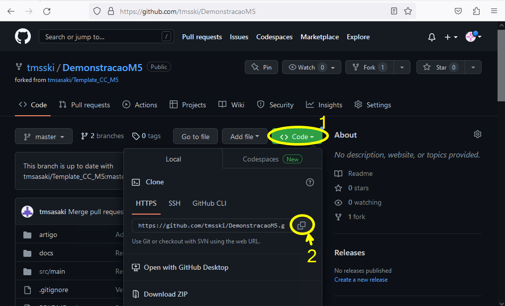
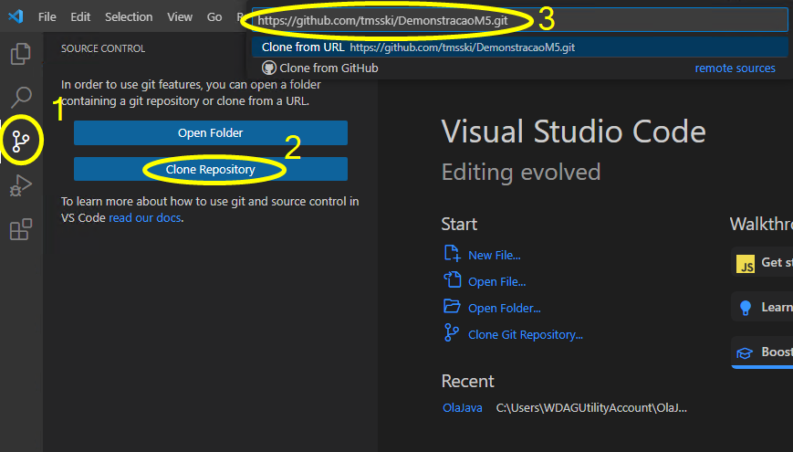
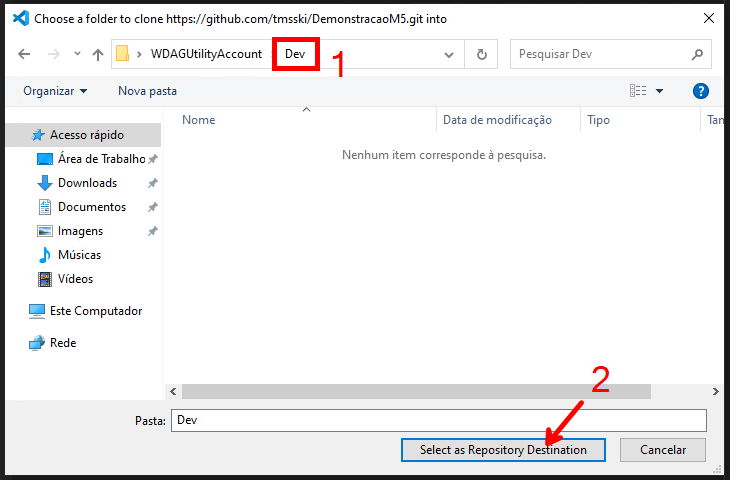

# Como Clonar Repositórios no Github

Neste tutorial, serão apresentadas algumas técnicas para realizar as operações de ***clone*** de um repositório. Estas operações são necessárias para que os membros do projeto possam contribuir com o código-fonte do projeto.

## Clone de Repositório

A operação de clonar um repositório, cria uma cópia local do repositório remoto. Para realizar esta operação, basta executar o comando `git clone` seguido do endereço do repositório remoto. Por exemplo, para clonar um repositório que está disponível no Github, primeiro é preciso de sua URL. A figura abaixo ilustra a operação de copiar a URL do repositório que será clonado.

Em `1`, é possível ver o botão `Code` que permite visualizar a URL do repositório. Em `2`, é possível ver a URL do repositório e o botão `Copy` que permite copiar a URL do repositório.

Para adicionar esse repositório localmente, é necessário que o usuário esteja dentro do diretório onde o repositório será clonado. Ele também deve possuir algum software de controle de versão instalado localmente. Para o Windows, recomenda-se a utilização do [Git Bash](https://gitforwindows.org/). Para o Linux, recomenda-se a utilização do terminal padrão do sistema operacional. Para o MacOS, recomenda-se a utilização do terminal padrão do sistema operacional. 

A utilização do Git dentro do [Visual Studio Code](https://code.visualstudio.com/) também é possível. Para isso, é necessário clicar em `1`. Depois selecionar a opção `Clone Repository`, como apresentado em `2`. Em seguida, é necessário informar a URL do repositório que será clonado, como apresentado em `3`. 

Por fim, é necessário selecionar o diretório onde o repositório será clonado, como apresentado em `1`. Agora basta clicar em `2` para iniciar o processo de clonagem do repositório.

